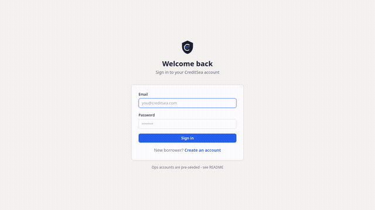

<div align="center">

# CreditSea — Loan Management System

**A full-stack lending platform where borrowers apply for loans and internal executives manage them through their lifecycle.**

[](https://www.typescriptlang.org/)
[](https://nextjs.org/)
[](https://expressjs.com/)
[](https://www.mongodb.com/)
[](https://tailwindcss.com/)

[Live Demo](https://frontend-seven-red-n64umfrt2w.vercel.app) · [API Docs](docs/API.md) · [Architecture](docs/DESIGN.md) · [Decisions](docs/DECISIONS.md)

</div>

---

## Overview

CreditSea is a loan management system with two main parts:

- **Borrower Portal** — Multi-step application: signup, personal details + BRE, salary slip upload, loan config & apply
- **Operations Dashboard** — 4 role-specific modules: Sales, Sanction, Disbursement, Collection + Admin overview

### Tech Stack

| Layer | Technology |
|-------|-----------|
| Frontend | Next.js 14 (App Router) + TypeScript + Tailwind CSS |
| Backend | Express.js + TypeScript |
| Database | MongoDB 7 (replica set for transactions) |
| Auth | JWT + bcrypt |
| Testing | Vitest (unit) + Playwright (e2e) |

### Key Features

- **Business Rule Engine** — Age (23-50), salary (>=25K), PAN format, employment checks on both client and server
- **Simple Interest Loan Math** — SI = (P x R x T) / (365 x 100) at 12% p.a., terms frozen at apply time
- **RBAC** — 6 roles (Admin, Sales, Sanction, Disbursement, Collection, Borrower) enforced on frontend and backend
- **Auto-Close** — Loans automatically close when outstanding balance reaches zero
- **UTR Uniqueness** — Database-level unique index prevents duplicate payment records
- **Transactional Payments** — Payment recording and auto-close happen in a single MongoDB transaction

---

## Quick Start

### Prerequisites
- Node.js 18+
- Docker (for MongoDB)

```bash
# 1. Start MongoDB (single-node replica set)
docker compose up -d
# Wait ~10s for rs.initiate() to complete
docker compose ps   # mongo should show "healthy"

# 2. Backend
cd backend
cp .env.example .env
npm install
npm run build
npm run seed          # creates 6 role accounts + demo borrowers
npm run dev           # http://localhost:5000

# 3. Frontend (new terminal)
cd frontend
npm install
npm run dev           # http://localhost:3000
```

Open **http://localhost:3000** and sign in with any account below.

### Demo Video

3-minute walkthrough of the complete borrower-to-closure flow:



> [Download full video](demo-video.mp4) (MP4, higher quality)

| Step | Description |
|------|-------------|
| 1 | Borrower signup + login |
| 2 | Personal details + BRE pass |
| 3 | Salary slip upload |
| 4 | Loan config & apply |
| 5 | Sales dashboard (lead tracking) |
| 6 | Sanction approve |
| 7 | Disbursement with UTR |
| 8 | Collection dashboard |
| 9 | Admin overview |

---

## Login Credentials

All accounts use password: **`Password@123`**

| Role | Email | Access |
|------|-------|--------|
| Admin | admin@creditsea.com | All modules |
| Sales | sales@creditsea.com | Sales module |
| Sanction | sanction@creditsea.com | Sanction module |
| Disbursement | disbursement@creditsea.com | Disbursement module |
| Collection | collection@creditsea.com | Collection module |
| Borrower | borrower@creditsea.com | Borrower portal |

---

## Project Structure

```
creditsea-lms/
├── backend/
│   └── src/
│       ├── config/          # DB, env, logger
│       ├── controllers/     # Request handlers
│       ├── middleware/       # Auth, RBAC, upload, error handling
│       ├── models/          # Mongoose schemas (User, Loan, Payment)
│       ├── repositories/    # DB query layer
│       ├── routes/          # Express route definitions
│       ├── serializers/     # API response formatters
│       ├── services/        # Business logic (BRE, loan math, dashboard)
│       ├── seed/            # Idempotent seed script
│       ├── tests/           # Vitest unit tests
│       └── utils/           # ApiError, asyncHandler, JWT
├── frontend/
│   └── src/
│       ├── app/             # Next.js App Router pages
│       │   ├── (auth)/      # Login, signup
│       │   ├── borrower/    # Borrower portal (4 steps)
│       │   └── dashboard/   # Ops dashboard (4 modules + admin)
│       ├── components/      # Reusable UI (Modal, Page, Stepper, etc.)
│       └── lib/             # API client, auth, types, formatting
├── e2e/                     # Playwright end-to-end tests
├── docs/
│   ├── DESIGN.md            # Architecture + 12 Mermaid diagrams
│   ├── DECISIONS.md         # 22 Architecture Decision Records
│   └── API.md               # REST API reference
├── docker-compose.yml       # MongoDB replica set
└── playwright.config.ts     # E2E test config
```

---

## API Endpoints

### Auth
| Method | Endpoint | Auth | Description |
|--------|----------|------|-------------|
| POST | `/api/auth/register` | Public | Create borrower account |
| POST | `/api/auth/login` | Public | Login, returns JWT |
| GET | `/api/auth/me` | Bearer | Current user profile |

### Borrower
| Method | Endpoint | Auth | Description |
|--------|----------|------|-------------|
| GET | `/api/borrower/stage` | Borrower | Current funnel stage |
| PUT | `/api/borrower/details` | Borrower | Save personal details + BRE |
| POST | `/api/borrower/salary-slip` | Borrower | Upload salary slip |
| PATCH | `/api/borrower/loan-config` | Borrower | Save loan parameters |
| GET | `/api/borrower/loans` | Borrower | List borrower's loans |
| POST | `/api/borrower/loans/:id/payments` | Borrower | Record payment |

### Loans
| Method | Endpoint | Auth | Description |
|--------|----------|------|-------------|
| POST | `/api/loans/apply` | Borrower | Apply for loan |
| GET | `/api/loans?status=X` | Executive | List loans by status |
| PATCH | `/api/loans/:id/decision` | Sanction | Approve or reject |
| PATCH | `/api/loans/:id/disburse` | Disbursement | Mark as disbursed |
| POST | `/api/loans/:id/payments` | Collection | Record payment |

### Dashboard
| Method | Endpoint | Auth | Description |
|--------|----------|------|-------------|
| GET | `/api/dashboard/sales/leads` | Sales | Registered borrowers |
| GET | `/api/dashboard/sales/converted` | Sales | Borrowers with loans |
| GET | `/api/dashboard/sanction/pending` | Sanction | Applied loans |
| GET | `/api/dashboard/disbursement/pending` | Disbursement | Sanctioned loans |
| GET | `/api/dashboard/collection/pending` | Collection | Disbursed loans |
| GET | `/api/dashboard/admin/loans` | Admin | All loans |

See [docs/API.md](docs/API.md) for full request/response examples.

---

## Architecture Decisions

This project follows a layered backend architecture with 22 documented Architecture Decision Records:

| ADR | Decision |
|-----|----------|
| ADR-001 | Monorepo structure |
| ADR-003 | Server-authoritative BRE |
| ADR-006 | Terms frozen at apply time |
| ADR-008 | UTR unique via DB index |
| ADR-010 | Auto-close in transaction |
| ADR-015 | 5-layer backend architecture |
| ADR-019 | Float safety with Math.round |
| ADR-021 | Borrower self-service payments |
| ADR-022 | Multiple active loans allowed |

See [docs/DECISIONS.md](docs/DECISIONS.md) for all 22 ADRs.

---

## Testing

```bash
# Unit tests (34 tests)
cd backend && npm test

# Smoke tests (35 tests)
bash /tmp/opencode/smoke.sh

# E2E tests (18 tests)
npx playwright test
```

---

## License

This project was built as a hiring assignment for CreditSea.
