# Design Document — CreditSea Loan Management System

Complete system design: architecture, data model, UML diagrams (ER, class, sequence, state), API contract, RBAC model, and business rules. All diagrams use [Mermaid](https://mermaid.js.org/) and render natively on GitHub.

---

## Table of Contents

1. [System Architecture](#1-system-architecture)
2. [High-Level User Flow](#2-high-level-user-flow)
3. [Data Model — ER Diagram](#3-data-model--er-diagram)
4. [Class / Model Diagram](#4-class--model-diagram)
5. [Loan Lifecycle — State Machine](#5-loan-lifecycle--state-machine)
6. [Sequence Diagrams](#6-sequence-diagrams)
7. [RBAC Model](#7-rbac-model)
8. [Business Rule Engine (BRE)](#8-business-rule-engine-bre)
9. [Loan Mathematics](#9-loan-mathematics)
10. [Module Design — Operations Dashboard](#10-module-design--operations-dashboard)
11. [Deployment / Runtime View](#11-deployment--runtime-view)
12. [Known Drawbacks](#12-known-drawbacks)

---

## 1. System Architecture

A decoupled two-tier architecture: a Next.js SPA-style frontend talking to a stateless Express REST API over JSON + JWT. MongoDB is the only datastore; salary slips are stored on the server filesystem (see [ADR-007](DECISIONS.md#adr-007)).

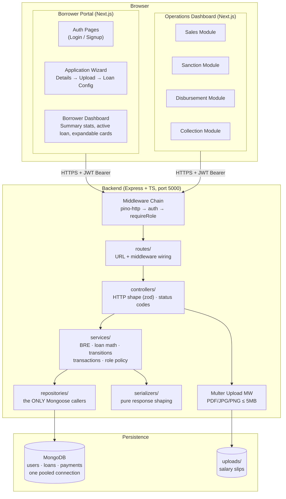

**Key properties**

- **Stateless API** — every request carries a JWT; the server keeps no session state, so it scales horizontally.
- **Layered backend (ADR-015)** — strict `routes → controllers → services → repositories` dependency rule; business logic never touches Mongoose directly and is unit-testable without a database.
- **Server-authoritative business rules** — the client duplicates BRE math only for live UX feedback; the server is the single source of truth (see [ADR-003](DECISIONS.md#adr-003)).
- **Role-filtered UI, role-enforced API** — hiding a dashboard module is cosmetic; the API independently rejects unauthorized calls with `403`.

---

## 2. High-Level User Flow

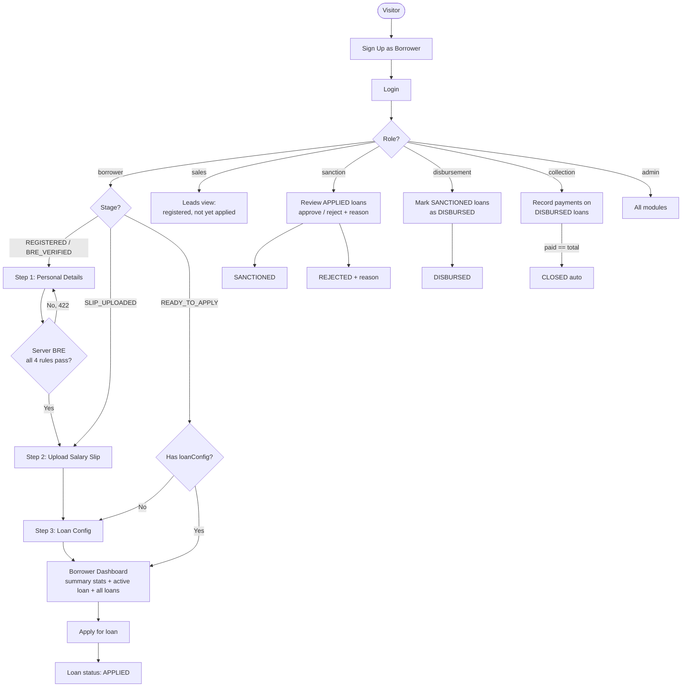

**Stage routing (GET /api/borrower/stage):** The stage endpoint returns `{ stage, hasLoanConfig }`. The frontend redirect logic:
- `REGISTERED` / `BRE_VERIFIED` → personal-details
- `SLIP_UPLOADED` → salary-slip
- `READY_TO_APPLY` + `hasLoanConfig: true` → borrower dashboard (loans page)
- `READY_TO_APPLY` + `hasLoanConfig: false` → loan-config

---

## 3. Data Model — ER Diagram

Three collections. `users` and `loans` are 1-to-many; `loans` and `payments` are 1-to-many. Payment `utr` has a **unique index** — database-level guarantee against duplicates, not just app-level validation.

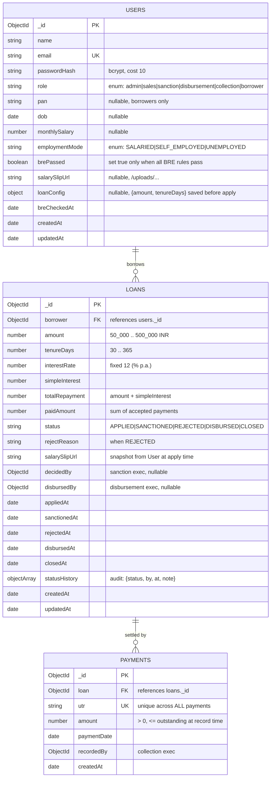

### Design notes

- **Derived vs stored fields**: `simpleInterest` and `totalRepayment` are *stored* (not recomputed on read) so the loan terms are frozen at application time — an interest-rate change later never rewrites history. `paidAmount` is denormalized from payments and updated transactionally for cheap outstanding-balance reads.
- **`salarySlipUrl` on Loan**: Snapshotted from `user.salarySlipUrl` at apply time. The salary slip URL is immutable once the loan is applied — if the user re-uploads a slip later, existing loans keep the original reference.
- **`loanConfig` on User**: `{ amount, tenureDays }` saved via `PATCH /api/borrower/loan-config` before applying. The apply endpoint uses these saved values if no explicit amount/tenure is passed in the request body.
- **`brePassed` on User**: eligibility is a property of the *borrower*, not the loan. One successful BRE check unlocks any number of loan applications.
- **`statusHistory[]`**: embedded audit trail — every transition records who, when, and why. Avoids a separate audit collection for this assignment's scale (drawback noted in §12).

---

## 4. Class / Model Diagram

Backend code organization — models, services (pure logic), middleware, and controllers.

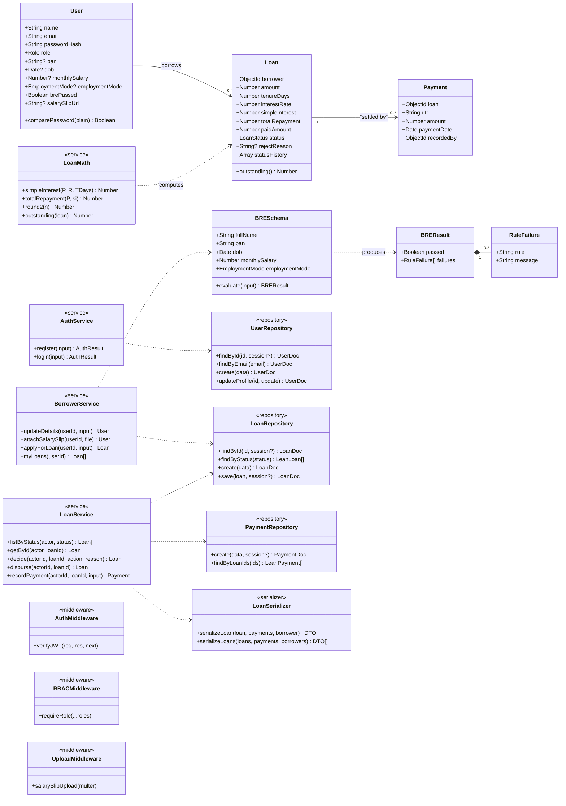

**Layering rule (ADR-015)**: `routes → controllers → services → repositories → models`, nothing skips a layer. Controllers only parse HTTP shape (zod) and set status codes; services own business rules, transactions, and role policy; repositories are the ONLY Mongoose callers; serializers are pure functions. Domain logic (`bre.ts`, `loanMath.ts`) is pure and unit-tested in isolation with no database.

---

## 5. Loan Lifecycle — State Machine

Only three actor types can trigger transitions. Every other combination is rejected with `409 Conflict`.

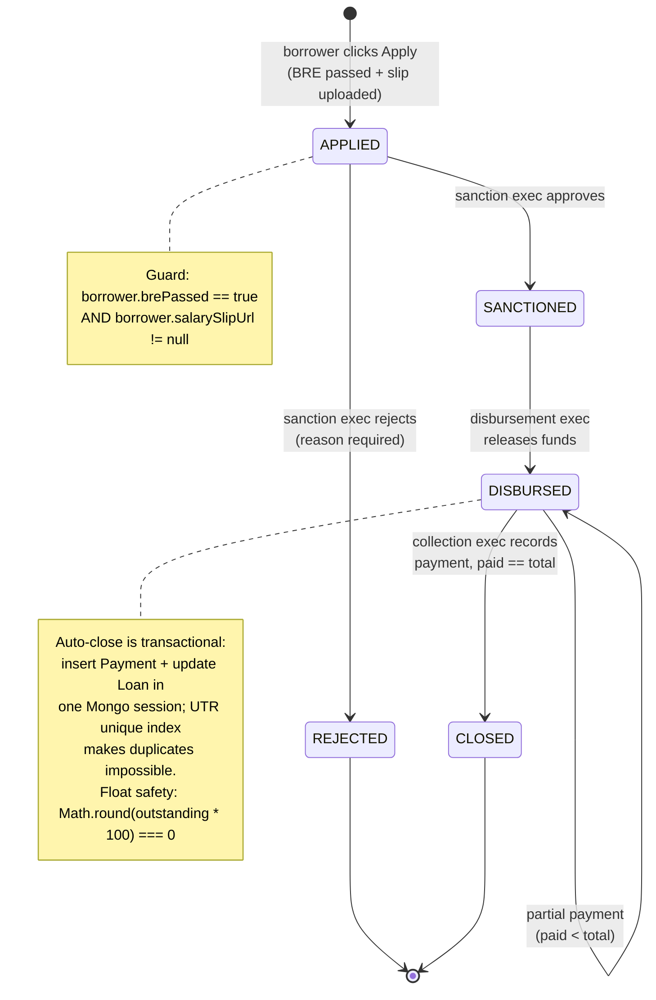

**Invalid transitions** (all → `409`): `APPLIED → DISBURSED` (skips sanction), `SANCTIONED → CLOSED` (no disbursement), `REJECTED → *` (terminal), acting on `CLOSED`, a borrower editing a loan after `APPLIED`, etc.

---

## 6. Sequence Diagrams

### 6.1 Borrower applies for a loan (happy path + BRE failure)

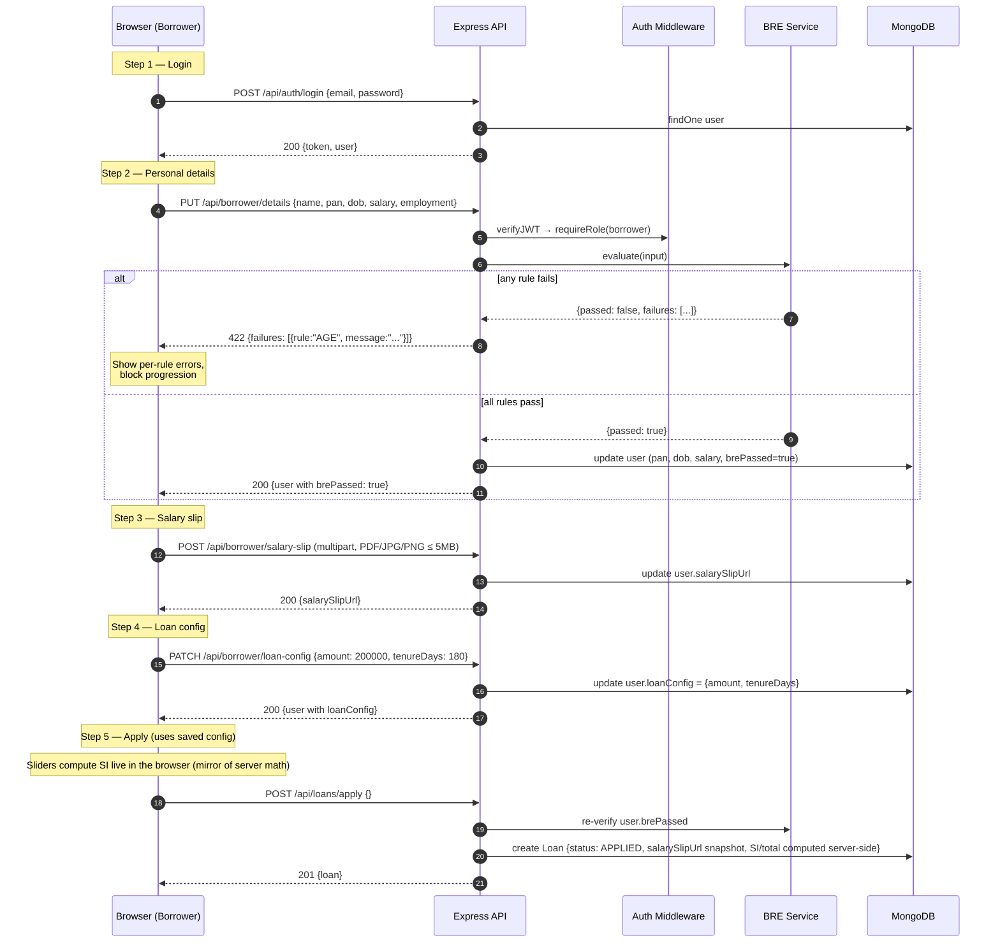

### 6.2 Sanction decision

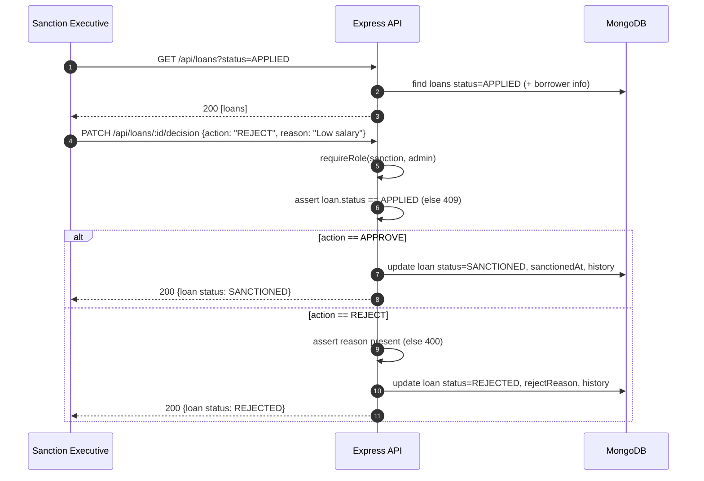

### 6.3 Disbursement

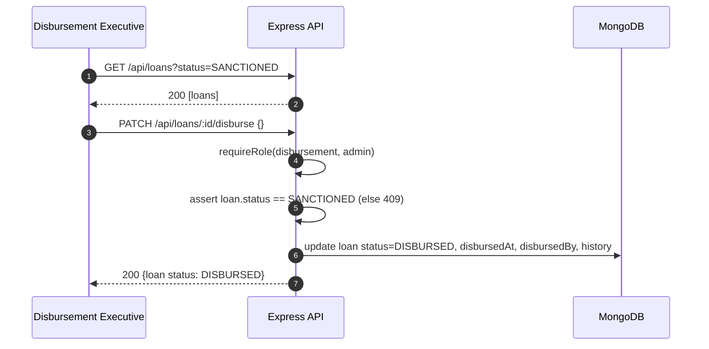

### 6.4 Payment recording + auto-close (transactional)

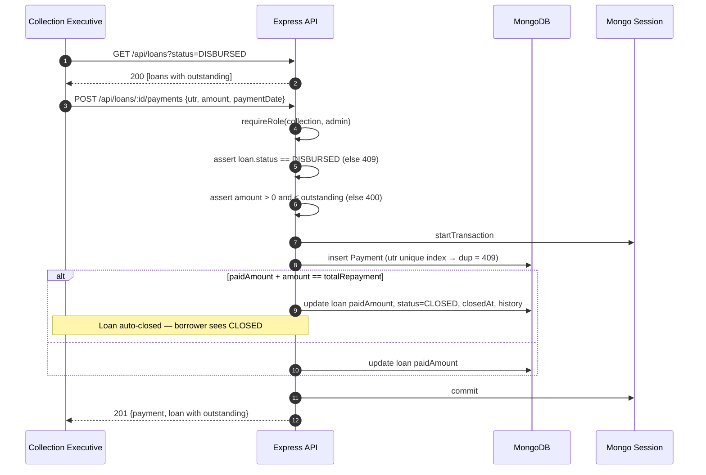

---

## 7. RBAC Model

Roles: `admin`, `sales`, `sanction`, `disbursement`, `collection`, `borrower`.

### 7.1 Permission matrix

| Capability | Borrower | Sales | Sanction | Disbursement | Collection | Admin |
|---|:-:|:-:|:-:|:-:|:-:|:-:|
| Apply for loan, upload slip, own details | ✔ | | | | | |
| View own loans/payments only | ✔ | | | | | |
| View leads (registered, no loan) | | ✔ | | | | ✔ |
| List/review `APPLIED` loans | | | ✔ | | | ✔ |
| Approve / reject loans | | | ✔ | | | ✔ |
| List `SANCTIONED` loans; disburse | | | | ✔ | | ✔ |
| List `DISBURSED/CLOSED` loans; record payments | | | | | ✔ | ✔ |
| Access dashboard at all | | ✔ | ✔ | ✔ | ✔ | ✔ |

### 7.2 Enforcement flow

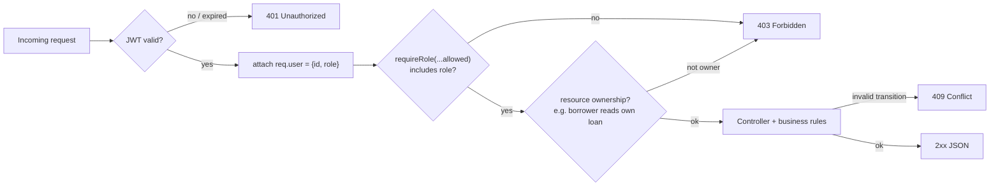

- **401** = "I don't know who you are" (missing/invalid token). **403** = "I know you, but you can't do this" (valid token, wrong role). Distinction kept deliberately (see [ADR-005](DECISIONS.md#adr-005)).
- Role is embedded in the JWT **and** re-read from the DB user document on protected routes, so a stale token after a role change is still safe.
- Frontend mirrors the matrix for UX (sidebar items, route guards) — but it is **never** trusted as the security boundary.

---

## 8. Business Rule Engine (BRE)

Pure function `evaluate(input): BREResult` — no I/O, fully unit-testable, runs on the **server**. The borrower form runs the same rules client-side for instant feedback only.

| Rule | Condition | Failure message |
|---|---|---|
| `AGE` | 23 ≤ age(dob) ≤ 50 (computed at submission) | "Applicant age must be between 23 and 50 years" |
| `SALARY` | monthlySalary ≥ ₹25,000 | "Monthly salary must be at least ₹25,000" |
| `PAN` | matches `/^[A-Z]{5}[0-9]{4}[A-Z]$/` | "PAN must follow the format ABCDE1234F" |
| `EMPLOYMENT` | employmentMode ≠ `UNEMPLOYED` | "Unemployed applicants are not eligible" |

All four must pass → `brePassed = true` is persisted on the user; the apply endpoint re-checks it server-side.

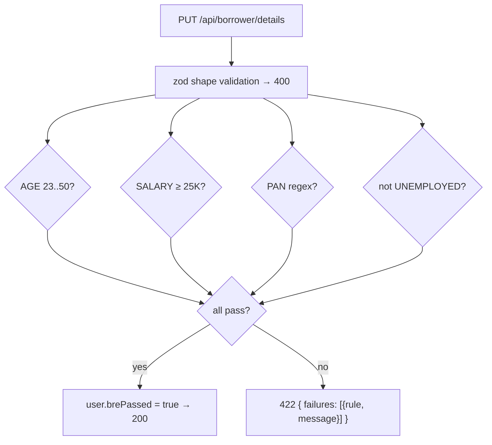

---

## 9. Loan Mathematics

Simple interest, fixed rate 12% p.a., tenure in days:

```
SI              = (P × R × T) / (365 × 100)     where T = tenureDays, R = 12
Total Repayment = P + SI
Outstanding     = Total Repayment − paidAmount
```

- All money values rounded to **2 decimal places** (`round2`) on both server and client, so the live slider panel always matches the stored loan to the paisa.
- Payment validation: `0 < amount ≤ outstanding` (overpayment rejected with `400`); the final payment that zeroes outstanding flips the loan to `CLOSED` in the same transaction.

---

## 10. Module Design — Operations Dashboard

### Borrower Portal

| View | Description |
|---|---|
| **Dashboard** (`/borrower/loans`) | Summary stats (total loans, outstanding, paid, closed), active loan highlight with progress bar, expandable loan cards with history, quick links to config/upload |
| **Personal Details** (`/borrower/personal-details`) | 2-column form + BRE rules sidebar. Live client-side validation mirrors server BRE |
| **Salary Slip** (`/borrower/salary-slip`) | 2-column upload zone + info sidebar. PDF/JPG/PNG ≤ 5 MB |
| **Loan Config** (`/borrower/loan-config`) | 2-column sliders + live calc panel + loan terms sidebar. Saves to `user.loanConfig` |

The stepper (Details → Slip → Config → Loans) is hidden once all steps are complete, giving the borrower a clean dashboard view. The layout uses `max-w-5xl` with tight spacing.

### Operations Dashboard

| Module | Data shown | Actions |
|---|---|---|
| **Sales** (leads) | Registered borrowers with `role=borrower` who have **no loan**: name, email, registration date, funnel stage (`REGISTERED` → `BRE_VERIFIED` → `SLIP_UPLOADED` → `READY_TO_APPLY`) | none (visibility only — lead tracking) |
| **Sanction** | `APPLIED` loans: borrower profile, amount, tenure, SI, total, slip link | Approve → `SANCTIONED`; Reject → `REJECTED` (reason required) |
| **Disbursement** | `SANCTIONED` loans awaiting fund release | Mark Disbursed → `DISBURSED` |
| **Collection** | `DISBURSED` + `CLOSED` loans: total, paid, outstanding, progress bar, payment history | Record Payment (UTR, amount, date) |

Sales funnel stage is **derived**, not stored — computed from which profile fields/loans exist, so it can never drift out of sync.

---

## 11. Deployment / Runtime View

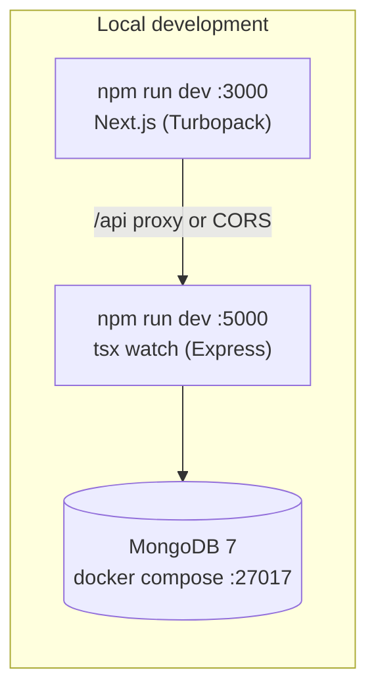

- Backend: `tsx watch` for hot reload, Mongoose auto-index in dev.
- Frontend: Next.js rewrites `/api/*` to the Express server (no CORS pain in dev).
- Seed: `npm run seed` idempotently upserts role accounts + demo data.

---

## 12. Known Drawbacks

Full analysis with alternatives lives in [DECISIONS.md](DECISIONS.md#drawbacks--tradeoffs). Summary:

1. **Local filesystem for salary slips** — breaks with multiple server instances / ephemeral containers; S3 (or MinIO) is the production answer.
2. **No refresh tokens / no logout revocation** — single long-lived JWT (7d); a stolen token is valid until expiry.
3. **Monetary amounts as JS `number`** — safe at this assignment's scale (≤ ₹5L, 2dp) but floats invite rounding bugs; production would use integer paise or `decimal128`.
4. **Denormalized `paidAmount` on loans** — cheap reads, but every payment write must update it inside a transaction; an application bug writing outside the transaction could desync it.
5. **`statusHistory[]` embedded** — fine for ≤ hundreds of events; unbounded arrays are an anti-pattern at scale.
6. **No pagination** on list endpoints — fine for demo volumes; would need cursor pagination in production.
7. **No real notification system** — borrowers must poll the dashboard for status changes.
8. **Plain REST, not websockets** — executives see stale lists until refetch (mitigated with TanStack Query refocus/invalidate).

---

*Cross-references: [DECISIONS.md](DECISIONS.md) (ADRs + tradeoffs) · [API.md](API.md) (full endpoint reference) · [README.md](../README.md) (setup + credentials).*
